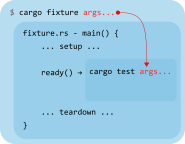

# cargo-fixture

[](https://github.com/vojtechkral/cargo-fixture/actions/workflows/CI.yaml)
[](https://crates.io/crates/cargo-fixture)
[](https://docs.rs/cargo-fixture-lib)

`cargo fixture` is a cargo extension that let's you surround `cargo test` with arbitrary Rust setup and teardown code.

<a href="doc/diagram.png" target="_blank"></a>

It can be used to run network servers that tests connect to, spin up docker containers, prepare test data, check for presence of programs,... or really anything that can be done from Rust code. Any provided resources can be released after `cargo test` finishes, whether manually, using RAII guards or closures.

Data can be passed from fixture to tests using environment variables, in-memory K-V storage, or files. Additionally, the option to define serial tests is provided.

##### Example projects:

- [HTTP server](examples/http)
- [DB in a Docker container](examples/docker)

### Installation

```sh
cargo install -f cargo-fixture
```

### Rationale

While resources can be provided using code in tests themselves, this often forces one to combine many testcases into one `#[test]` or requires usage of various hacks in order to sync tests up. Custom harnesses are not well supported yet, inconvenient and face limitations (such as no output capturing).

This solution provides the same experience as regular `cargo test`, testcases can be written in pretty much the same way as usual and can stay granular.

### Getting started

The `cargo fixture` command is used the same way as the `cargo test` command with the difference that it starts a _fixture_ before running `cargo test`. The fixture continues running while `cargo test` runs, it is then told about test success and is given time to perform cleanup.

`cargo fixture` has the same general CLI syntax as `cargo test` and except a few own flags it forwards all arguments to it.

`cargo fixture` also builds code with a special feature `_fixture` enabled in order to distinguish tests used with a fixture from regular ones.
This feature needs to be defined in `Cargo.toml`:

```toml
[features]
_fixture = []
```

A fixture is a Rust program in the `tests` subdirectory declared as not part of regular (libtest) test set in `Cargo.toml`:

```toml
[[test]]
name = "my_fixture"
test = false
harness = false
```

The file is expected to contain a `main()` function. The fixture and tests communicate with `cargo-fixture` using clients from [`cargo-fixture-lib`](https://docs.rs/cargo-fixture-lib), a Unix domain socket is used under the hood. The library uses async I/O.

A fixture looks something like this:

```rust
async fn main() {
    // Connect to the cargo fixture host
    let mut fixture = FixtureClient::connect().await.unwrap();

    // Prepare the environment...

    // Let cargo fixture know tests can be run now, wait for result
    let success = fixture.ready().await.unwrap();
    eprintln!("Tests finished, success: {success}");

    // Wrap up.
}
```

A test that uses the fixture environment is then defined like this:

```rust
#[with_fixture]
#[tokio::test]
async fn some_test(client: TestClient) {
    // interact with whatever fixture has prepared for us.
    // client can be used to obtain K-V data.
}
```

The `#[with_fixture]` macro marks the test `#[ignore]` outside of the `_fixture` feature, so that when you run plain old `cargo test`, the test that require fixture are skipped! This way, you can have a hefty fixture but still run unit tests using just `cargo test` quickly.

### Multiple fixtures

Use `cargo fixture -F <name>` to use a fixture program different than the default (`fixture`).

### Troubleshooting fixtures

The `-x` flag lets you replace the `cargo test` command with a custom one. You can use this to run a shell instead of `cargo test`:

```sh
cargo fixture -x sh
```

This will ready the fixture and then enter a shell, in which you can inspect whether the fixture environment is prepared correctly, interact with it, or even run `cargo test` and interact with the environment post-tests.

### Platform support

Async runtime: [Tokio](https://tokio.rs/), [smol](https://docs.rs/smol).

OS: Linux, Mac OS, Windows 10 or later.
